> **BLUF:** NASA/JPL-grade testing protocol defining 14 test categories, bidirectional requirements traceability, assertion density mandates, MC/DC coverage, and forensic artifact requirements. An agent reading this document knows exactly what to build, what tools to use, and what "done" looks like.

# Testing Protocol: The Proving Ground

> **"Untested code is broken code. A test that passes randomly is a prayer, not proof."**

---

## 1. The Testing Laws

1. **Trust No Return Value** — A function saying "success" is unverified. Query state to prove it.
2. **The Artifact IS The Proof** — The output of a test is not "PASSED". It's a forensic report.
3. **Zero-Error Tolerance** — A single `ERROR` or `CRITICAL` log during any test = automatic failure, regardless of assertions passing.
4. **No Report = No Pass** — A test that produces no artifact is invalid. Reports are mandatory.
5. **Fail Fast, Fail Loud** — Tests run in order from fastest to slowest. First failure halts the cascade.
6. **Isolation Is Non-Negotiable** — Each test starts clean, runs in isolation, leaves no side effects.
7. **Trace Everything** — Every test must trace back to a requirement. Every requirement must trace forward to a test. (DO-178C §6.4)
8. **Assert Densely** — Minimum 2 assertions per function under test. Assertions remain active in production. (NASA JPL Power of Ten, Rule 5)
9. **Flaky = Broken** — A test that fails intermittently is quarantined immediately. No flaky tests in the main suite.

---

## 2. The Testing Pyramid

All test categories below are defined in order of execution (fastest → slowest). **An agent implementing testing for a new project must evaluate each tier and implement all that apply.**

```mermaid
graph TD
    subgraph "Execution Order — Fast → Slow"
        A["1. Static Analysis"] --> B["2. Unit Tests"]
        B --> C["3. Property-Based Tests"]
        C --> D["4. Snapshot Tests"]
        D --> E["5. Mutation Tests"]
        E --> F["6. Integration Tests"]
        F --> G["7. Contract Tests"]
        G --> H["8. Fuzz Tests"]
        H --> I["9. E2E Tests"]
        I --> J["10. GUI/Visual Tests"]
        J --> K["11. Performance Tests"]
        K --> L["12. Chaos/Resilience Tests"]
        L --> M["13. Soak/Endurance Tests"]
        M --> N["14. Hardware-in-the-Loop"]
    end
```



---

## 3. Static Analysis — "The Gatekeeper"

Inspects code **without executing it**. Catches ~40% of bugs in milliseconds.

| Tool | Purpose | Threshold |
|:-----|:--------|:----------|
| **Linter** (Ruff, ESLint) | Style, unused imports, formatting | Zero warnings |
| **Type Checker** (MyPy, tsc) | Static type verification | Strict mode |
| **Complexity Analyzer** (Radon, Xenon) | Cyclomatic complexity | No function > 10 |
| **Dead Code Detector** (Vulture) | Unreachable code | Zero unreachable |
| **Security Scanner** (Bandit, Snyk) | CVEs, hardcoded secrets, injection | Zero HIGH/CRITICAL |
| **Dependency Audit** (pip-audit, npm audit) | Known vulnerabilities in deps | Zero CRITICAL/HIGH |
| **Coverage** (Coverage.py, Istanbul) | Line/branch coverage measurement | ≥80% line coverage |

**Execution**: Static analysis runs **first** in every pipeline. If any tool fails, pipeline halts.

**Agent Rule**: When setting up a new project, configure ALL applicable static analysis tools before writing the first test.

---

## 4. Unit Tests — "The Logic Check"

Validate **isolated functions** with no external dependencies.

| Principle | Rule |
|:----------|:-----|
| **AAA Pattern** | Arrange → Act → Assert |
| **Single Responsibility** | One test = One behavior |
| **Fast Execution** | < 100ms per test |
| **No Side Effects** | No network, no disk, no database |
| **External deps mocked** | All I/O boundaries mocked |
| **Assertion density** | ≥2 assertions per test function (NASA JPL Rule 5) |

**Tools**: pytest, Jest, JUnit, Go testing — whatever matches the project language.

**Coverage minimum**: ≥80% line coverage. 100% for shared/common libraries.

**Agent Rule**: Every public function must have at least one unit test. Safety-critical functions must have boundary and error-path tests.

---

## 5. Property-Based Tests — "The Edge-Case Hunter"

Instead of testing specific inputs, **define invariants** and let the framework generate thousands of random inputs including edge cases (NaN, Infinity, empty, zero, negative, huge).

```python
# Example: Hypothesis (Python)
from hypothesis import given, strategies as st

@given(value=st.floats(allow_nan=True, allow_infinity=True))
def test_clamp_always_bounded(value):
    result = clamp(value, min_val=-100, max_val=100)
    assert -100 <= result <= 100
```

**When required**:
- All validation/sanitization functions
- All numeric processing (clamping, scaling, conversion)
- All data model validators

**Tools**: Hypothesis (Python), fast-check (JS), QuickCheck (Haskell/Go)

---

## 6. Snapshot Tests — "The Drift Detector"

Serialize complex outputs and compare against saved baselines. Detects unintended schema or output changes.

**When required**:
- Data model serialization formats (API responses, database schemas)
- Configuration file outputs
- UI component renders

**Tools**: Syrupy (Python), Jest Snapshots (JS)

```bash
# Update snapshots after intentional changes
pytest tests/snapshot/ --snapshot-update
```

---

## 7. Mutation Tests — "The Test Quality Auditor"

Measures test **quality**, not just coverage. Makes small changes to source code ("mutants") and checks if tests catch them.

| Mutation Type | Original | Mutated | Tests... |
|:--------------|:---------|:--------|:---------|
| Arithmetic | `a + b` | `a - b` | Math correctness |
| Comparison | `x > 0` | `x >= 0` | Boundary handling |
| Boolean | `return True` | `return False` | Control flow |
| Constant | `MAX = 100` | `MAX = 200` | Config assertions |

**Target**: ≥80% mutation kill rate. 100% for safety-critical code.

**Tools**: mutmut (Python), Stryker (JS/TS), PIT (Java)

---

## 8. Integration Tests — "The Wiring Check"

Validates that **two or more components** communicate correctly.

| Scope | What It Validates |
|:------|:------------------|
| API roundtrip | Request → Handler → Response → Client |
| Database I/O | Writes persist, reads return correct data |
| Message queue | Producer → Queue → Consumer |
| Service-to-service | Service A call → Service B response |

**Principle**: Use **real** dependencies where possible (real database, real queue). Mock only external third-party services.

---

## 9. Contract Tests — "The Handshake Verifier"

Ensures producers and consumers agree on API/message schemas. Critical for microservices and multi-agent systems.

```python
def test_api_response_contract(snapshot):
    """Producer and Consumer agree on response schema."""
    schema = ResponseModel.model_json_schema()
    assert schema == snapshot
```

**When required**: Every inter-service API, every message format agents exchange.

**Tools**: Pact, schema snapshot comparisons

---

## 10. Fuzz Tests — "The Crash Finder"

Inject random/malformed inputs into parsers, APIs, and deserializers.

**Goal**: Target must survive **millions of random inputs** without crashing, hanging, or leaking memory.

**When required**: All message parsers, all API endpoints accepting external input, all file parsers.

**Tools**: Atheris (Python), AFL (C/C++), go-fuzz (Go)

---

## 11. End-to-End Tests — "The Full Stack Proof"

Run the **entire system** from input to output.

**Requirements**:
- Every major user flow / system mode must have at least one E2E test
- E2E tests must generate forensic reports (see §15)
- All subprocess launches must use process isolation

**Process Isolation**: Each component under test runs with its own working directory, its own data directory, and communicates only through defined interfaces (API, queue, socket). No shared filesystem side-channels.

---

## 12. GUI / Visual Tests — "The Pixel Proof"

For projects with user interfaces, verify actual rendered output.

| Technique | What It Catches |
|:----------|:----------------|
| Screenshot comparison | Visual regressions |
| Element presence | Missing UI components |
| Color/pixel verification | Rendering correctness |
| Accessibility scanning | WCAG compliance |

**Tools**: Playwright, Cypress, Percy (visual diff), axe (accessibility)

---

## 13. Performance Tests — "The Stopwatch"

**Define latency budgets** for critical paths, benchmark them, and fail on regression.

```bash
# Save baseline
pytest tests/performance/ --benchmark-save=baseline

# Compare — fail if 10% slower
pytest tests/performance/ --benchmark-compare=baseline --benchmark-compare-fail=min:10%
```

**Agent Rule**: Any commit that makes code 10% slower than baseline = pipeline failure.

**Tools**: pytest-benchmark, k6, Locust, wrk

---

## 14. Chaos / Resilience Tests — "The Torture Chamber"

Intentionally **break things** to verify graceful degradation.

| Scenario | Method | Success Criteria |
|:---------|:-------|:-----------------|
| Process death | `kill -9` a critical service | System detects loss, degrades gracefully |
| Latency spike | Inject 2-5 second delays | Other components remain responsive |
| Resource exhaustion | Consume all RAM/CPU | System sheds load, core survives |
| Network partition | Disconnect components | Graceful reconnection, no data loss |

---

## 15. Soak / Endurance Tests — "The Marathon"

Run the system under normal load for **extended periods** (hours to days) to detect:
- Memory leaks
- File handle exhaustion
- Database growth / bloat
- Performance degradation over time
- Resource contention under sustained load

**Output**: Soak reports with resource usage graphs over time.

---

## 16. Hardware-in-the-Loop (HIL) — "The Final Gate"

For projects with physical hardware components. Run code on actual embedded hardware with simulated I/O.

**When required**: IoT, robotics, embedded systems, hardware control software.

---

## 17. Test Artifacts & Forensic Reports

> **"No Report = No Pass."**

Every test run must produce artifacts:

```
tests/artifacts/
├── master_report.md              # Overall summary
├── static/                       # Linter, type checker, security reports
├── unit/                         # Individual unit test reports
├── integration/                  # Integration test evidence
├── e2e/                          # E2E reports + screenshots
├── performance/                  # Benchmark results
└── chaos/                        # Resilience test reports
```

### Master Report Requirements

| Section | Content |
|:--------|:--------|
| Header | Timestamp, git commit, branch |
| Test Matrix | Table of all test types with PASS/FAIL |
| Failure Details | Test name, error, link to individual report |
| Coverage Summary | Line %, branch %, mutation score |
| Verdict | Overall PASS/FAIL |

### Individual Test Report Requirements

1. **Metadata**: Name, category, duration, timestamp
2. **Assertions made**: What was verified
3. **Evidence**: State snapshots, database queries, screenshots
4. **Log summary**: Error count, warning count, relevant excerpts
5. **Verdict**: PASS/FAIL with reason

---

## 18. Execution Order (Fail-Fast Cascade)

```
1. Static Analysis     → Fastest. Catches typos, types, security.
2. Unit Tests          → Fast. Catches logic errors.
3. Property Tests      → Catches edge cases.
4. Snapshot Tests      → Catches drift.
5. Mutation Tests      → Catches weak tests.
6. Integration Tests   → Catches wiring errors.
7. Contract Tests      → Catches schema disagreements.
8. Fuzz Tests          → Catches parser crashes.
9. E2E Tests           → Slow. Full stack validation.
10. GUI/Visual Tests   → Catches visual regressions.
11. Performance Tests  → Catches speed regressions.
12. Chaos Tests        → Catches resilience failures.
13. Soak Tests         → Catches long-duration issues.
```

**Rule**: If any tier fails, all subsequent tiers are skipped. Fix the fastest-failing tier first.

---

## 19. Requirements Traceability (DO-178C §6.4)

> **"If you can't trace a test to a requirement, why does the test exist? If a requirement has no test, how do you know it works?"**

Every test must have **bidirectional traceability**:

```
Requirement → Design → Code → Test → Test Result
     ↑___________________________________________↓
```

### Implementation

Use the `Refs:` field in test docstrings to link back to CODEX docs:

```python
def test_token_refresh():
    """Verify JWT refresh within sliding window.
    
    Refs: EVO-012, BLU-005
    Requirement: Users must not be logged out during active sessions.
    """
```

### Traceability Matrix

Maintain a traceability matrix (in `CODEX/40_VERIFICATION/`) mapping:

| Requirement ID | Requirement | Test File | Test Function | Status |
|:---------------|:------------|:----------|:--------------|:-------|
| EVO-012 | Session persistence | test_auth.py | test_token_refresh | ✅ |
| BLU-005 | API auth spec | test_auth.py | test_jwt_validation | ✅ |

**Agent Rule**: When creating tests, ALWAYS link to the requirement being verified. When creating requirements, ALWAYS verify a test exists or create one.

---

## 20. Coverage Thresholds

| Metric | Standard | Safety-Critical | Enforcement |
|:-------|:---------|:----------------|:------------|
| Line coverage | ≥80% | ≥95% | CI blocks merge |
| Branch coverage | ≥75% | ≥90% | CI blocks merge |
| Function coverage | 100% public | 100% all | CI blocks merge |
| Mutation score | ≥80% | ≥95% | CI blocks merge |
| MC/DC coverage | N/A | **Required** | CI blocks merge |
| Assertion density | ≥2 per test | ≥3 per test | Linter warns |

### MC/DC Coverage (DO-178C DAL-A)

For safety-critical code paths, **Modified Condition/Decision Coverage** is required. Each condition in a boolean decision must independently affect the outcome:

```python
# Decision: if (A and B) or C
# MC/DC requires proving each condition independently flips the result:
# Test 1: A=T, B=T, C=F → True   (baseline)
# Test 2: A=F, B=T, C=F → False  (A independently affects result)
# Test 3: A=T, B=F, C=F → False  (B independently affects result)  
# Test 4: A=F, B=F, C=T → True   (C independently affects result)
```

**When required**: Any function controlling safety, authorization, financial transactions, or destructive operations.

---

## 21. Regression Testing Policy

Every **bug fix** must include a regression test that:
1. **Reproduces** the original failure (test fails without the fix)
2. **Verifies** the fix (test passes with the fix)
3. **Remains** in the suite permanently — never deleted

```python
def test_regression_issue_42_null_token():
    """Regression: null tokens caused 500 error.
    
    Refs: DEF-042
    Fixed: 2026-03-04
    """
    response = api.refresh(token=None)
    assert response.status_code == 401  # Not 500
```

**Agent Rule**: When fixing a bug, the FIRST step is writing a failing test. The LAST step is confirming it passes.

---

## 22. Flaky Test Quarantine

A test that passes sometimes and fails sometimes is **broken**, not "intermittent."

| Action | When |
|:-------|:-----|
| **Quarantine immediately** | Mark with `@pytest.mark.quarantine` or equivalent |
| **Investigate within 48h** | Root cause: race condition? Timing? Shared state? |
| **Fix or delete** | No test stays quarantined for more than 1 sprint |
| **Never ignore** | A flaky test that's ignored will mask real failures |

Common flaky test causes:
- Shared mutable state between tests (fix: proper teardown)
- Timing-dependent assertions (fix: use polling/retries with timeouts)
- Port conflicts (fix: random port allocation)
- File system race conditions (fix: temp directories per test)

---

## 23. Test Environment Reproducibility

> **"If I can't reproduce your test result on a clean machine, your test is worthless."**

| Requirement | How |
|:------------|:----|
| **Pinned dependencies** | Lockfiles (`poetry.lock`, `package-lock.json`) committed |
| **Deterministic seeds** | Random seeds fixed and logged for reproducibility |
| **Isolated temp dirs** | Each test run uses fresh `tempfile.mkdtemp()`, cleaned after |
| **No host-dependent paths** | Use relative paths or env vars, never hardcoded absolutes |
| **CI = Local parity** | Tests must pass identically in CI and on developer machines |
| **Documented env setup** | `CODEX/30_RUNBOOKS/` contains test environment setup guide |

---

## 24. Test Independence & Review

> NASA IV&V mandates that critical test verification be performed by someone other than the author.

| Practice | Rule |
|:---------|:-----|
| **Tests written by non-author** | For safety-critical code, tests should be written or reviewed by a different agent/person than the code author |
| **Peer review of test logic** | Test assertions reviewed for correctness, not just code coverage |
| **No self-verifying PRs** | The agent that wrote the code should not be the sole reviewer of its tests |

---

## 25. Agent Instructions

When an architect asks you to "set up testing" or "add tests," follow this checklist:

1. **Read this protocol** — understand all 14 tiers + requirements traceability
2. **Assess applicability** — not every project needs HIL or chaos tests, but tiers 1-9 are almost always required
3. **Start from the top** — implement static analysis first, then unit, then work down
4. **Create the artifact directory structure** (§17)
5. **Configure pytest markers** or equivalent:
   ```ini
   [pytest]
   markers =
       unit: Pure unit tests (no I/O)
       integration: Multi-component tests
       e2e: Full system tests
       slow: Tests > 1 second
       safety: Safety-critical path tests
       quarantine: Flaky tests under investigation
   ```
6. **Set up coverage** with minimum thresholds (§20)
7. **Create traceability matrix** linking requirements to tests (§19)
8. **Add to CI pipeline** in fail-fast order (§18)
9. **Ensure assertion density** ≥2 per test function
10. **Pin all dependencies** with lockfiles for reproducibility (§23)
11. **Update `CODEX/00_INDEX/MANIFEST.yaml`** when test specs are created

---

> **"We choose to do the hard things not because they are easy, but because the easy things make systems crash in production."**
