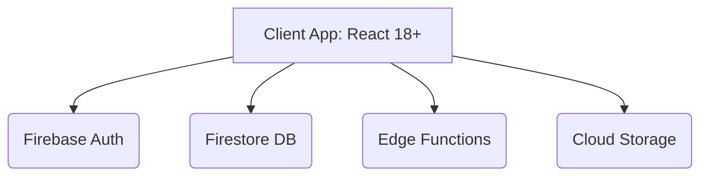

> **BLUF:** This document outlines the system architecture and core feature specifications for PropManage Pro, an enterprise-grade property management platform designed for the Winston-Salem, NC market. It details the serverless React/Firebase stack, key functional modules, security considerations, and future roadmap integration points.

## 1. Description & Goals
PropManage Pro is designed to replace fragmented spreadsheets and legacy property management software with a unified, real-time, agentic-driven platform. The target demographic is small-to-midsize property owners and management firms.

### 1.1 Key Objectives
- **Centralization**: Provide a single pane of glass for portfolio, financial, and document management.
- **Automation**: Automate critical workflows like late fee calculation, marketing syndication, and legal document generation.
- **Velocity**: Leverage agentic development to produce enterprise-grade software iteratively with minimal overhead.

## 2. Architecture & Design

### 2.1 High-Level Architecture
The platform is built on a fully serverless, edge-hosted architecture designed for high availability and zero infrastructure management.

### 2.2 Component Specifications

#### Frontend
- **Framework**: Next.js 14/15 (App Router) for superior Edge SSR and SEO routing.
- **Styling**: Tailwind CSS with shadcn/ui and Radix UI Primitives for enterprise-grade data tables and components.
- **Iconography**: Lucide-React.
- **State Management**: TanStack Query v5 (React Query) for aggressive data caching (reducing Firebase read costs) combined with Zustand for Client State.

#### Backend & Data Tier
- **Database**: Firebase Firestore (NoSQL). Document-based, real-time sync.
- **Authentication**: Firebase Auth (Custom Tokens for Roles, Anonymous for public listings).
- **Backend Logic**: Firebase Cloud Functions (Edge infrastructure).

### 2.3 Core Functional Modules

#### 2.3.1 Dashboard & Intelligence Center
The central hub for portfolio health observability.
- **KPI Engine**: Uses Cloud Functions to trigger aggregations whenever ledgers update. Dashboard reads a single `portfolio_stats` document to maintain 1-read per login (Free Tier optimization).
- **Alert System**: Evaluates `current_date` against `property.due_day` to flag "Overdue" status.
- **Late Fee Calculator**: Chron job/Edge function calculating `Daily Accrued Late Fees`.
- **Quick Action Matrix**: Component for rapid task execution (e.g., POST `/properties/new`).

#### 2.3.2 Portfolio & Asset Management
- **CRUD**: Full management suite for Property entities.
- **Data Model**: Includes relational mappings (`Name`, `Address`, `Monthly Rent`, `Due-Day`, `Daily Fee`, `Status`).
- **Media**: Dynamic image handling via Cloud Storage. Implementation emphasizes client-side image compression (`browser-image-compression` <500KB) *before* hitting Cloud Storage to respect the 5GB Free Tier limit.
- **Status Enum**: `AVAILABLE`, `OCCUPIED`, `MAINTENANCE`.

#### 2.3.3 Financial & Rent Tracking
- **Ledger System**: Immutable transaction logs tied to user UIDs.
- **Rent State Machine**: `PENDING` -> `PAID` / `LATE` -> `DEFAULT`.
- **Double-Entry Accounting Sync**: Exposes an API point to map transactions to a Chart of Accounts or sync with QuickBooks Online (QBO).
- **Fee Engine**: Rules-based calculator applying daily fees post-"Grace Period".

#### 2.3.4 Document Management System (DMS) & E-Signatures
- **Template Engine**: Merges Firestore data (`{tenant_name}`, `{property_address}`, `{total_due}`) into Legal Templates.
- **E-Signature Pipeline**: Integrates with HelloSign/DocuSign API to wrap generated PDFs in legally binding electronic envelopes.
- **Templates**: Residential Lease, 5-Day Pay or Quit (NC specific), Late Notice.
- **Output**: PDF rendering (`@react-pdf/renderer` or Server-side puppeteer).

#### 2.3.5 Public Marketing Portal & Screening
- **Syndication**: Auto-publishes properties with `STATUS=AVAILABLE` powered by Next.js SSR for maximum SEO reach.
- **Lead Capture & Application Screening**: Secure portal where prospective tenants trigger automated background, eviction, and credit checks via integrated API (e.g., TransUnion SmartMove).
- **SEO Strategy**: Server-side rendering (SSR) for public property routes.

#### 2.3.6 Vendor & Work Order Management
- **Maintenance Dispatch**: Assign work orders to external vendors directly from tenant-submitted maintenance requests.
- **Vendor Tracking**: Track cost estimates, vendor assignment, and attach 3rd-party invoices to the property ledger.

## 3. Data Schema & Models

### 3.1 Collections (Firestore)

**`users`**
- Permissions, Role (Admin, Tenant, Owner).

**`properties`**
- `id`, `name`, `address_line1`, `address_line2`, `city`, `state` (Default: NC), `zip`, `status`, `rent_amount`, `due_day`, `grace_period`, `daily_late_fee`, `owner_uid`.

**`tenants`**
- `id`, `property_id`, `name`, `email`, `phone`, `lease_start`, `lease_end`.

**`ledgers`**
- `id`, `tenant_id`, `property_id`, `amount_due`, `amount_paid`, `status`, `due_date`, `late_fees_accrued`.

## 4. Security & Compliance

### 4.1 Data Integrity
- **Multi-Tenancy**: Enforced strictly via Firestore Rules (`request.auth.uid == resource.data.owner_uid`).
- **Auditability**: Mandatory `createdAt` and `updatedAt` timestamps on all mutations.

### 4.2 User Experience
- **Non-disruptive UI**: Elimination of native browser alerts (`window.alert`). Implementation of custom toast/modal notification systems to maintain enterprise feel.

## 5. Third-Party Libraries

| Library | License | Stars | Why |
|---------|---------|-------|-----|
| Next.js | MIT | 120k | SOTA Framework for edge SSR and SEO capabilities |
| Tailwind CSS | MIT | 73k | Utility-first styling, standard for modern React apps |
| shadcn/ui | MIT | 50k | Accessible, enterprise-grade styled components |
| TanStack Query | MIT | 38k | Aggressive caching to minimize Firestore document reads |
| Firebase JS SDK | Apache 2.0 | N/A | Core backend integration |
| Lucide React | ISC | 9k | Consistent, customizable icons |
| @react-pdf/renderer | MIT | 13k | PDF generation in React |
| Vercel AI SDK | Apache 2.0 | 8k | Edge streaming for AI chat using BYOK keys |

## 6. Risk Assessment

### 6.1 High Risk Areas
1. **Firebase Cost Escalation & Free Tier Limits**
   - *Risk*: Uncontrolled reads/writes on the dashboard KPIs can exhaust the 50,000 read daily limit, leading to high costs.
   - *Mitigation*: STRICT adherence to denormalization (Cloud functions maintain a single aggregated `portfolio_stats` doc). Aggressive caching via TanStack Query (high staleTime).
2. **Media Storage Cost Escalation**
   - *Risk*: Tenants uploading uncompressed large images (e.g., 8MB photos) will exceed the 5GB Free Tier limit quickly.
   - *Mitigation*: Client-side media compression built directly into input forms.
2. **PDF Legal Compliance**
   - *Risk*: Generated documents (especially NC 5-Day notices) must meet strict legal formatting.
   - *Mitigation*: Template verification by legal counsel; clear disclaimers.
3. **Data Isolation**
   - *Risk*: Security rule misconfiguration could expose User A's data to User B.
   - *Mitigation*: Comprehensive security rule testing (`@firebase/rules-unit-testing`).

## 7. Future Dependencies (Roadmap)
- **Stripe**: ACH/Credit Card payment gateway integration for direct rent collection.
- **Storage/Media handling**: Requirements for tenant maintenance photo uploads.
- **AI Tooling**: API integration for the future Agentic Assistant Chatbot.
