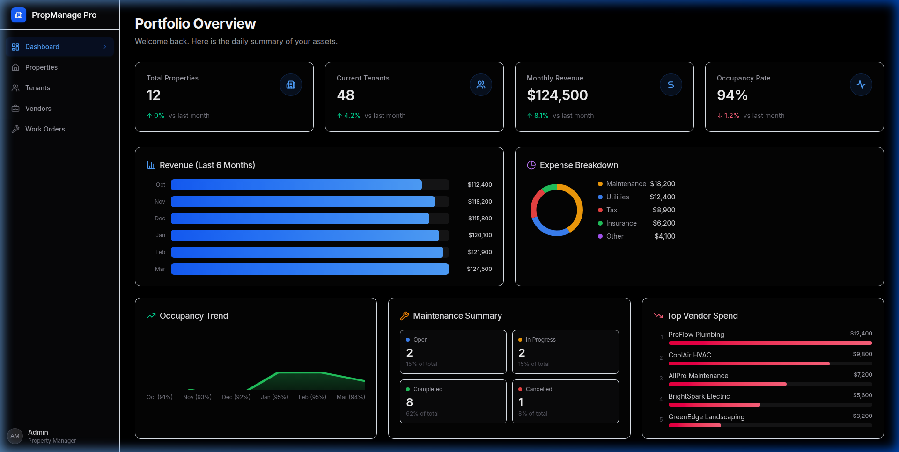

# PropManage Pro

> Enterprise-grade property management platform built with Next.js 16, React 19, and Firebase — engineered to NASA/JPL coding standards.




**🌐 Live Demo:** [mylab-481117.web.app](https://mylab-481117.web.app)

---

## Features

| Module | Description |
|:-------|:------------|
| **Dashboard** | Portfolio overview with 4 KPI cards, revenue chart, expense breakdown (donut), occupancy trend, maintenance summary, and top vendor spend |
| **Properties** | CRUD management with expandable rows, document attachments, status badges (active / maintenance / inactive) |
| **Tenants** | Lease tracking with active/expired status, rent formatting, and contact details |
| **Vendors** | Vendor registry with category filters, hourly rates, star ratings, license tracking, and W-9 compliance |
| **Work Orders** | Maintenance ticket system with priority badges (Low → Emergency), status lifecycle, vendor assignment, and cost tracking |

---

## Tech Stack

| Layer | Technology |
|:------|:-----------|
| Framework | Next.js 16.1.6 (Turbopack, App Router) |
| UI | React 19, Tailwind CSS 4, Lucide Icons |
| Language | TypeScript 5.9 (strict mode) |
| Testing | Vitest 4, Testing Library, Playwright |
| Hosting | Firebase Hosting (static export) |
| Backend | Firebase (Firestore, Auth, Storage) — seed data mode |
| CI Governance | CODEX system (GOV-001 → GOV-004) |

---

## Getting Started

### Prerequisites

- Node.js ≥ 20
- pnpm (or npm)

### Install & Run

```bash
# Clone
git clone https://github.com/BigRigVibeCoder/prop_manager_pro.git
cd prop_manager_pro/src

# Install dependencies
pnpm install    # or: npm install

# Start dev server
pnpm dev        # or: npm run dev
```

Open [http://localhost:3000](http://localhost:3000).

### Run Tests

```bash
# Unit tests (71 tests, 15 files)
pnpm test

# With coverage report
pnpm test:coverage

# E2E tests (Playwright)
pnpm test:e2e
```

### Build & Deploy

```bash
# Production build (static export)
pnpm build

# Deploy to Firebase
firebase deploy --only hosting
```

---

## Project Structure

```
prop_manager_pro/
├── CODEX/                    # Governance documentation system
│   ├── 10_GOVERNANCE/        # GOV-001 (Project Charter), GOV-002 (Testing), GOV-003 (Coding Standard)
│   ├── 40_VERIFICATION/      # Traceability matrix
│   └── 60_EVOLUTION/         # Sprint specs
├── src/
│   ├── app/                  # Next.js App Router pages
│   │   ├── page.tsx          # Dashboard
│   │   ├── properties/       # Properties CRUD + Documents
│   │   ├── tenants/          # Tenant Management
│   │   ├── vendors/          # Vendor Management
│   │   └── work-orders/      # Work Order Tickets
│   ├── components/           # Shared UI components
│   │   ├── dashboard/        # KPICard
│   │   └── layout/           # Sidebar navigation
│   ├── lib/                  # Core libraries
│   │   ├── auth/             # Firebase Auth context
│   │   ├── errors/           # GOV-004 error handling
│   │   ├── firebase/         # Firebase config
│   │   └── models/           # TypeScript interfaces
│   └── tests/
│       ├── unit/             # 15 Vitest test suites
│       ├── e2e/              # Playwright specs
│       └── artifacts/        # Coverage reports
├── firebase.json             # Hosting config
└── firestore.rules           # Security rules
```

---

## Code Quality Standards

This codebase follows the **GOV-003 Coding Standard** — a NASA/JPL-grade specification requiring:

- ✅ **File headers** with `@file`, `@brief`, `Used by`, `Related`
- ✅ **JSDoc** on all exported functions, interfaces, and components
- ✅ **Named constants** — zero magic numbers (`CENTS_PER_DOLLAR`, `MAX_RETRIES`)
- ✅ **TypeScript interfaces** for all component props
- ✅ **Guard clauses** for null/undefined handling
- ✅ **60-line function limit** enforced via ESLint
- ✅ **Cyclomatic complexity ≤ 10** enforced via ESLint

---

## Testing Protocol (GOV-002)

| Metric | Target | Actual |
|:-------|:------:|:------:|
| Test files | — | 15 |
| Total tests | — | 71 |
| Pass rate | 100% | **100%** |
| Line coverage | ≥80% | ✅ |
| Function coverage | 100% | ✅ |
| Branch coverage | ≥75% | ✅ |
| Assertion density | ≥2/test | ✅ |

---

## Environment Variables

Copy `.env.example` to `.env.local` and fill in your Firebase credentials:

```bash
cp src/.env.example src/.env.local
```

| Variable | Description |
|:---------|:------------|
| `NEXT_PUBLIC_FIREBASE_API_KEY` | Firebase Web API key |
| `NEXT_PUBLIC_FIREBASE_AUTH_DOMAIN` | Auth domain |
| `NEXT_PUBLIC_FIREBASE_PROJECT_ID` | GCP project ID |
| `NEXT_PUBLIC_FIREBASE_STORAGE_BUCKET` | Storage bucket |
| `NEXT_PUBLIC_FIREBASE_MESSAGING_SENDER_ID` | FCM sender ID |
| `NEXT_PUBLIC_FIREBASE_APP_ID` | Firebase app ID |

---

## License

MIT

---

> *Built with discipline. Tested with rigor. Deployed with confidence.*
